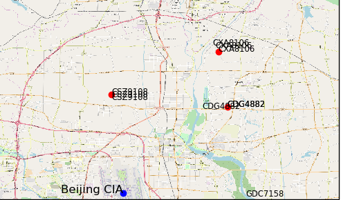

# flight-trace
A Python GIS exercise,gain gaining flight data  and Draw it on the map

Python GIS实例编程之航班跟踪实例配套代码，原文链接为

The URl link of the article is :

[百家号](http://baijiahao.baidu.com/builder/preview/s?id=1619006053973280873)

[公众号](http://mp.weixin.qq.com/s?__biz=MzU0MTY5MzEwMA==&mid=2247484271&idx=1&sn=21ff25fdf444072c883e3b0e946f6973&chksm=fb2746accc50cfbab731f6c5391d1991dec28cd92691f8b2075922a0f79ce5d21e5797374984&mpshare=1&scene=23&srcid=1205PdEQkaKM82v7qqf8CFDd#rd)
